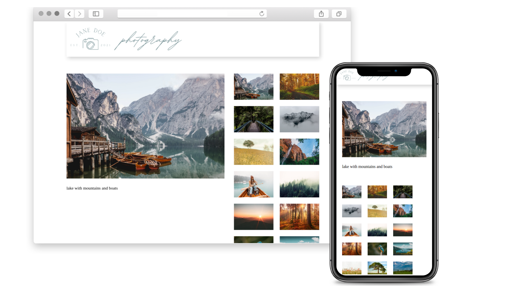

# Photogallery project

Explore [Live demo](https://alice-rez.github.io/simple-photogallery/)

Simple example of Photogallery page build just with Vanilla JavaScript - if clicked on small preview, the image will be displayed as a big image on the left side. When scrolling on desktop, the big image stays still on the same spot.

Previews added dynamically by JavaScript from an array. The array could be filled from database in real-world application. If necessary, simply adding more information to this source array and slightly adjusting the code of the showImage function would make it possible to dynamically display more information about the picture.

Styling is kept really clean to not clash with the photos.

**Used technologies:** Vanilla JS, DOM, DOM manipulation, CSS, CSS variables, CSS positioning HTML, SVG

